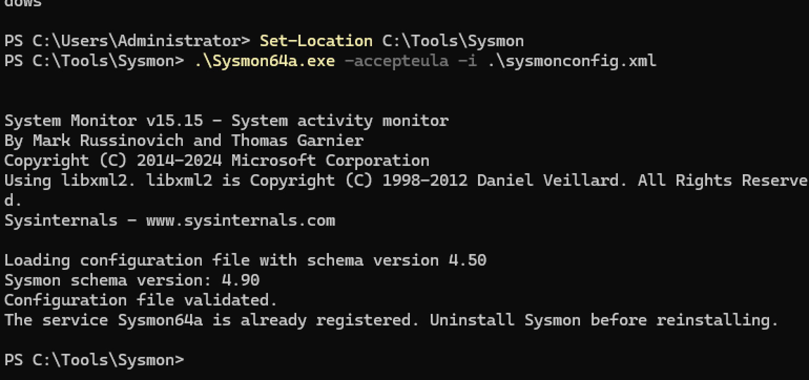
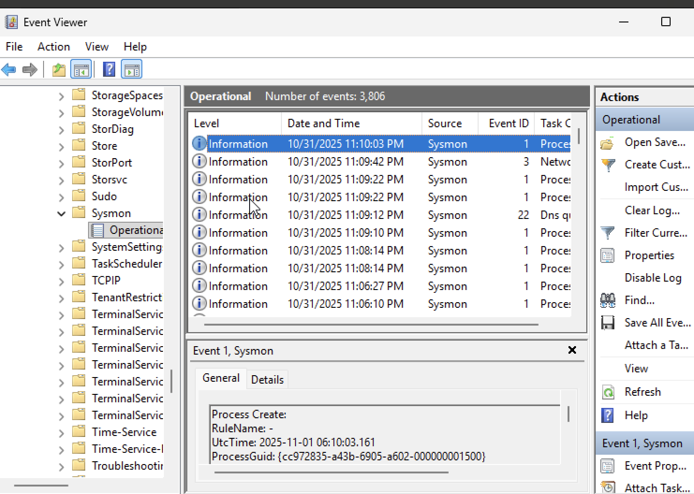
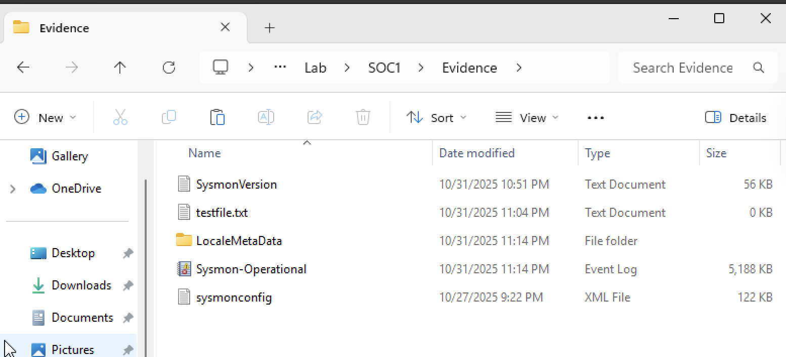
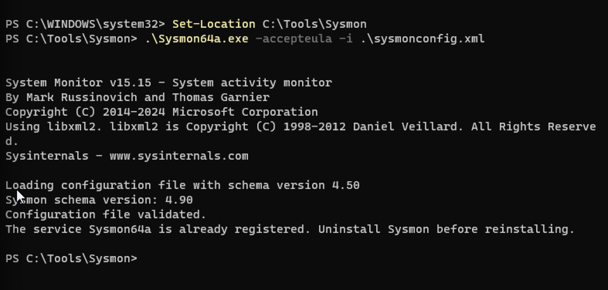
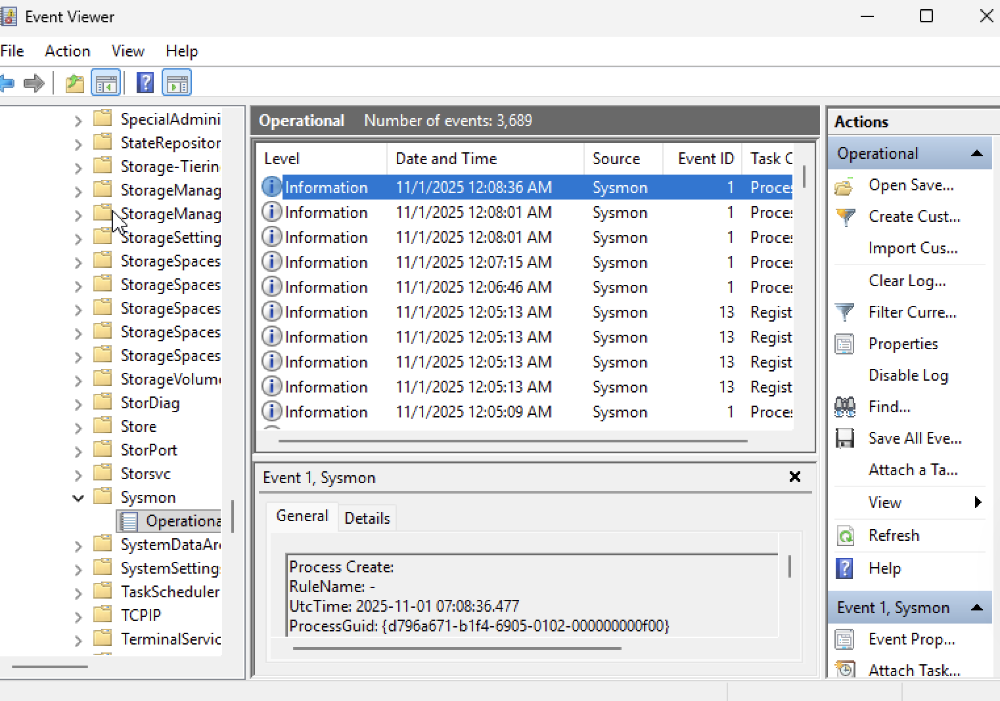

# SOC Lab 1 – Sysmon Setup

## 🎯 Objective
Install, configure, and validate **Sysmon** logging on two Windows endpoints (**Workstation01** and **DC01**) as the foundation for later Windows Event Forwarding (WEF) and SIEM ingestion.

This lab demonstrates:
- Proper Sysmon deployment and configuration
- Event validation (ProcessCreate, NetworkConnect, DNS Query, etc.)
- Export of raw `.evtx` event logs for analysis
- Evidence collection for security portfolio documentation

---

## 🖥️ Machines Used

| Hostname        | OS                  | Role                |
|-----------------|---------------------|---------------------|
| Workstation01   | Windows 11 Pro      | Client Endpoint     |
| DC01            | Windows Server      | Domain Controller   |

---

## ✅ Workstation01 Progress Checklist

| Step | Status | Description |
|------|--------|-------------|
| A1 | ✅ | Created `C:\Tools\Sysmon` and `C:\Lab\SOC1\Evidence` folders |
| A2 | ✅ | Placed Sysmon executable + config file |
| A3 | ✅ | Installed Sysmon using config |
| A4 | ✅ | Verified Sysmon service is running |
| A5 | ✅ | Enabled **Sysmon Operational** event log |
| A6 | ✅ | Captured Sysmon version + config hash |
| A7 | ✅ | Generated test events (ProcessCreate, NetworkConnect, DNS Query) |
| A8 | ✅ | Exported Sysmon-Operational.evtx log |
| A9 | ✅ | Collected artifacts into Evidence folder |

---

## 🖼️ Key Screenshots (Workstation01)

| Description | Screenshot |
|-------------|------------|
| Sysmon install command executed successfully |  |
| Sysmon event log showing test events |  |
| Final Workstation01 evidence folder |  |

<strong>Click to view full Workstation01 screenshot index</strong>

SOC1-01_Workstation01_CreateFolders.png
SOC1-02_Workstation01_SysmonFiles.png
SOC1-03_Workstation01_InstallCommand.png
SOC1-04_Workstation01_ServiceRunning.png
SOC1-05_Workstation01_EventLogEnabled.png
SOC1-06_Workstation01_SysmonVersion.png
SOC1-07_Workstation01_ConfigDump.png
SOC1-08_Workstation01_TestEvents.png
SOC1-09_Workstation01_ExportedLog.png
SOC1-10_Workstation01_ArtifactsFolder.png

yaml
Copy code

---

## 🗂️ Workstation01 Artifacts

| File | Purpose |
|------|---------|
| `Sysmon-Operational.evtx` | Raw exported Sysmon log |
| `SysmonVersion.txt` | Version + config hash output |
| `sysmonconfig.xml` | Config ruleset in use |
| `testfile.txt` | Trigger file for event logging |

Artifacts stored in:  
C:\Lab\SOC1\Evidence\

yaml
Copy code

---

## 🔹 System 2: DC01 (Domain Controller)

### ✅ DC01 Progress Checklist

| Step | Status | Description |
|------|--------|-------------|
| B1 | ✅ | Created `C:\Tools\Sysmon` and `C:\Lab\SOC1\Evidence` folders |
| B2 | ✅ | Placed Sysmon executable + config file |
| B3 | ✅ | Installed Sysmon using config |
| B4 | ✅ | Verified Sysmon service is running |
| B5 | ✅ | Enabled **Sysmon Operational** event log |
| B6 | ✅ | Captured Sysmon version + config hash |
| B7 | ✅ | Generated test events (ProcessCreate, NetworkConnect) |
| B8 | ✅ | Exported Sysmon-Operational.evtx log |
| B9 | ✅ | Collected artifacts into Evidence folder |

---

## 🖼️ Key Screenshots (DC01)

| Description | Screenshot |
|-------------|------------|
| Sysmon install command executed successfully |  |
| Sysmon event log showing test events |  |
| Final DC01 evidence folder |  |

<strong>Click to view full DC01 screenshot index</strong>

SOC1-01_DC01_CreateFolders.png
SOC1-02_DC01_SysmonFiles.png
SOC1-03_DC01_InstallCommand.png
SOC1-04_DC01_ServiceRunning.png
SOC1-05_DC01_EventLogEnabled.png
SOC1-06_DC01_SysmonVersion.png
SOC1-07_DC01_ConfigDump.png
SOC1-08_DC01_TestEvents.png
SOC1-09_DC01_ExportedLog.png
SOC1-10_DC01_ArtifactsFolder.png

yaml

---

## 🗂️ DC01 Artifacts

| File | Description |
|------|-------------|
| `SysmonVersion` | Output of `.\Sysmon64a.exe -c` |
| `testfile.txt` | Trigger file for event logging |
| `Sysmon-Operational.evtx` | Exported Sysmon event log |

Artifacts stored in:  
C:\Lab\SOC1\Evidence\

yaml

*Note: Event ID 11 (FileCreate) was not logged on DC01 because it was filtered out by the active Sysmon config.*

---

## 🔜 Next Steps

| Lab | Title | Focus |
|------|-------|-------|
| SOC Lab 2 | Windows Event Forwarding (WEF) | Forward Sysmon logs from endpoints → DC |
| SOC Lab 3 | SIEM Ingest | Send forwarded logs into SIEM |
| SOC Lab 4 | Detection Lab | Write Sigma rules and trigger alerts in SIEM |

---

🔧 *Built as part of a growing security analyst portfolio showcasing endpoint telemetry, log handling, and detection engineering fundamentals.*
